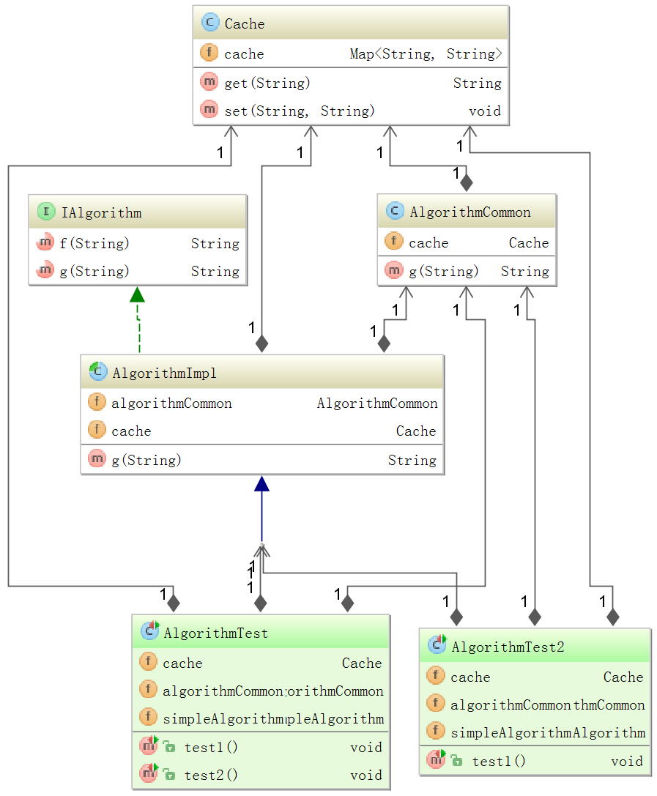

MockitoDemo
===========

Keyword: Mockito, Spring, Autowired, InjectMocks, Multiple levels Mock

Overview
----
In my project unit test, I need to test the various components managed under spring context. Some components have multiple levels dependant on others. I try to use Mockito to mock the ones that performs the DAO and outside store cache functionalities. I use the @Mock, @Spy and @InjectMocks annoations to accomplish this. But the weird thing is that I need to run the below code snippet twice in order to make the autowired field work corrent. 
```java
MockitoAnnotations.initMocks(this);
```
I am not sure whether this is a bug or an unspoorted feature for Mockito. So I create this demo project to better illustrate this problem.

Project Structure
--
The demo project class diagram is listed below:

 

I wrote two test class: AlgorithmTest & AlgorithmTest2. If I run AlgorithmTest2, all things go well with Spring autowired context. If I run AlgorithmTest, the com.zhaodong8701.mockitoDemo.AlgorithmTest#test2 will fail with message "simpleAlgorithm.algorithmCommon should not be null."

It seems Mockito does not handle the multiple levels mock injections. This behavior is different with Spring context autowired. Please HELP!

Thanks again for the good testing tool of Mockito!
